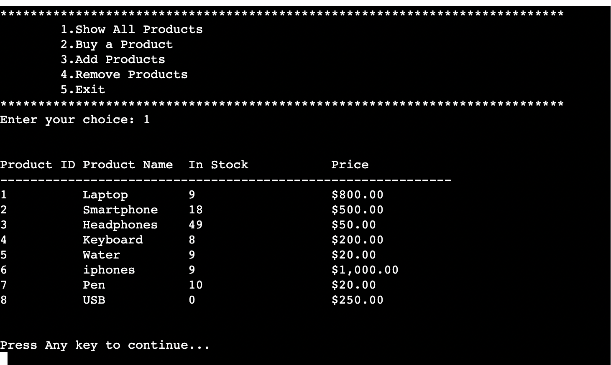

# Inventory-System
This inventory system manages product data, provides a user-friendly interface, and integrates with Google Sheets for data storage and retrieval. Users can view, purchase, and add products to the inventory system, while admin users have the additional privilege of adding new products.

The live link can be found here - [Inventory-system](https://inventory-system1-f97d13a346ff.herokuapp.com/)

## How to Play
 # Display All Products (Option 1):
  - When you run the program, you'll see a menu with options.
  - Choose option 1 to display all available products. It will show a list of products with their names, stock availability, and prices.

Screenshots

 # Buy Product (Option 2): 
  - Choose option 2 to buy a product.
  - You'll be prompted to enter the product ID and your name.
  - The program will generate an order summary and ask for confirmation.
  - If you confirm the order, it will generate a bill for the product.

Screenshots

 # Add Products (Admin Login Required, Option 3):
  - Choose option 3 to add products (requires admin login).
  - You'll need to enter an admin username and password. The default values are "Admin" and "password."
  - After logging in, you can add new products by entering their name, stock availability, and price.

  

Screenshots

 # Exit (Option 4):
  - Choose option 4 to exit the program.

Screenshots

## Site Owner Goals
- To provide the user with a simple game that is both challenging and rewarding.
- To present the user with an app that functions well and is easy to use. 

## User Stories

- ### As a user I want to:
  - As a store manager, I want to add new products to the inventory with details such as name, description, quantity in stock, and price so that I can keep track of the products I offer for sale.
  - As a warehouse employee, I want to update the quantity of a product in the inventory when new stock arrives or when products are sold, so that I can maintain accurate stock levels.
  - As a salesperson, I want to search for products in the inventory by name or category, so that I can quickly find the products that a customer is looking for.
  - As a customer, I want to view the available products in the inventory along with their prices, so that I can make informed purchasing decisions.
  - As a store manager, I want to receive notifications when the stock of a particular product falls below a certain threshold, so that I can reorder products in a timely manner.
  - As an administrator, I want to set user roles and permissions to control who can add, edit, or delete products, ensuring data integrity and security.

## Flow Chart

Screenshots

In order to visualise the flow of steps required in the game, I created a flow chart using Lucid Chart. It was beneficial for me to plan the project like this as it allowed me to gain an understanding of what functions were required for the game and at what stages and how the different elements of the game would interact.

It also allowed me to identify the different Objects I would need to implement. I was keen to use the principles of Object Oriented Programming in this application.

## Testing

### PEP8 Testing
The python files have all been passed through [PEP8 Online](http://pep8online.com/). All python files were checked with no errors reported. See screen show below:

Screenshots run.py

## Libraries and Technologies Used

### Python Libraries:

- [random](https://docs.python.org/3/library/random.html?highlight=random#module-random) - `random.choice` is used to select a random word for the game from a text file.
- [datetime](https://pypi.org/project/DateTime/): used to get today's date for the leaderboard entry.
- [gspread](https://pypi.org/project/gspread/): to allow communication with Google Sheets. 
- [requests](https://pypi.org/project/requests): enables data retrieval from APIs.
- [google.oauth2.service_account](https://google-auth.readthedocs.io/en/stable/index.html):  used to validate credentials and grant access to google service accounts.  
- [pyfiglet](https://pypi.org/project/pyfiglet/0.7/) - for taking ASCII text and rendering it into ASCII art fonts.
- [colorama](https://pypi.org/project/colorama/) - for adding colour to terminal text.

### Programs Used

- [GitHub](https://github.com/) - used for version control.
- [Heroku](https://dashboard.heroku.com/apps) -  used to deploy the live project.
- [Lucidchart](https://lucid.app/documents#/dashboard) -  used to create the game flowchart
- [PEP8 Online](http://pep8online.com/) - used to validate all the Python code
- [Grammerly](https://app.grammarly.com/) - used to proof read the README.md

### Colour Coding Letters in User Guess
Colorama is used to add the colour coding to each of the letters in the user guess. Each time a user makes a guess, that colour coded guess is added to the `guesses_list` so that all their guesses can be printed back to them after each turn. When I initially wrote the code to print out the user `guesses_list`, the colours were not printing out and the Colorama encoding was being printed out alongside the user guess, making it impossible to read.

After some research, I realised that the colours would only print out as a string (not a list). In order to overcome this problem, I used a `for` loop to print out each string in the `guesses_list` separately. 

## Deployment

The site was deployed via [Heroku](https://dashboard.heroku.com/apps), and the live link can be found here: [Word-Py](https://word-py.herokuapp.com/)

Before deploying to Heroku pip3 freeze > requirements.txt was used to add all the dependencies required to the requirements.txt file. This is required for the game to run on Heroku.

The following steps were then taken:
1. Log in to [Heroku](https://dashboard.heroku.com/apps) or create an account.
2. On the main page click the button labelled New in the top right corner and from the drop-down menu select "Create New App".
3. Enter a unique and meaningful app name.
4. Next select your region.
5. Click on the Create App button.
6. Click on the Settings Tab and scroll down to Config Vars.
7. Click Reveal Config Vars and enter port into the Key box and 8000 into the Value box and click the Add button.
8. Input CREDS and the content of your Google Sheet API creds file as another config var and click add.
9. In the next Key box enter OXFORD_API_APP_ID and add your unique ID to the value box. 
10. In the next Key box enter OXFORD_API_APP_KEY and add your unique key to the value box. 
11. Next, scroll down to the Buildpack section click Add Buildpack select Python and click Save Changes
12. Repeat step 11 to add node.js. Note: The Buildpacks must be in the correct order. If not click and drag them to move into the correct order.
13. Scroll to the top of the page and choose the Deploy tab.
14. Select Github as the deployment method.
15. Confirm you want to connect to GitHub.
16. Search for the repository name and click the connect button.
17. Scroll to the bottom of the deploy page and either click Enable Automatic Deploys for automatic deploys or Deploy Branch to deploy manually. Manually deployed branches will need re-deploying each time the repo is updated.
18. Click View to view the deployed site.

The site is now live and operational.

## Credits 
### Resources Used
- [W3Schools](https://www.w3schools.com/)  
- [Stack Overflow](https://stackoverflow.com/)
- [5 Letter Words List](https://7esl.com/5-letter-words/) - The list of five-letter words used in the game was taken from this site.
- [Count occurrences of a character in a string](https://stackoverflow.com/questions/1155617/count-the-number-of-occurrences-of-a-character-in-a-string) - I read about the Collections Counter method in this post.
- [How to set up environment variables in GitPod](https://code-institute-room.slack.com/archives/CP07TN38Q/p1576743956008500) - This post from anna_ci in the Code Institute slack channel was very informative and enabled me to set up my environment variables correctly for my API key. 
- [ASCII Art](https://www.asciiart.eu/art-and-design/borders) - I used this ASCII art for the border around the instructions.
- [How to get current date and time in Python](https://www.programiz.com/python-programming/datetime/current-datetime) - I used this article to learn about the strftime() method when getting the date for my leaderboard.
- [Pandas Sort: Your Guide to Sorting Data in Python](https://realpython.com/pandas-sort-python/) - I used this article to learn how to sort the leaderboard data for the table.
- [Center align column headers of a Pandas DataFrame](https://www.tutorialspoint.com/python-center-align-column-headers-of-a-pandas-dataframe) - I used this article when formating the leaderboard table.
- [Oxford Dictionary API Docs](https://developer.oxforddictionaries.com/documentation/getting_started) - This documentation came in useful when implementing the Oxford Dictionary API.
- I followed the steps in the Code Institute Python walkthrough project - Love Sandwiches when setting up my Google Sheets API.

## Acknowledgments

The Code Institute slack community for their quick responses and very helpful feedback!